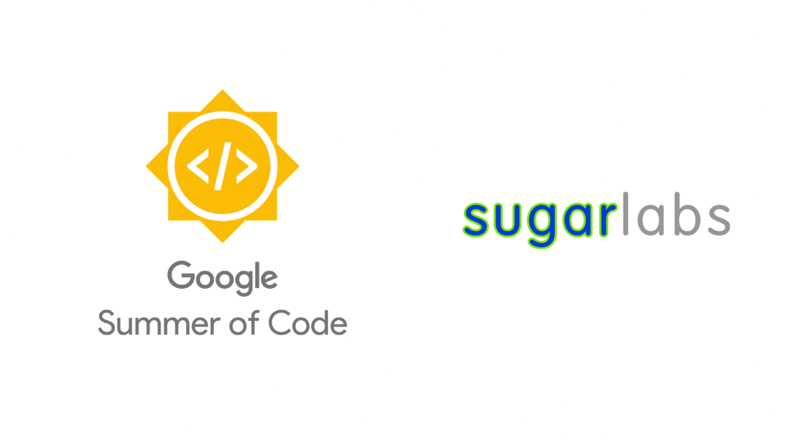

# Google Summer of Code 2022 Final report

## Title - Music Blocks V3 Maintenance

### Organization - Sugarlabs

This is a elucidation of my work on
[V3 Maintenance](https://summerofcode.withgoogle.com/programs/2022/projects/oiE2yRSV)
during *Google Summer of Code 2022* with
[Sugar Labs](https://github.com/sugarlabs/). This repository contains
[links](./authored-files/), samples of my work, and
examples.The code samples for changes related to improvements and bug fixes are present in [authored files](./authored-files).
 

## 📙 Abstract

[*Music Blocks*](https://musicblocks.sugarlabs.org/) is a Visual 
Programming Language and collection of manipulative tools for exploring
musical and mathematical concepts in an integrative and fun way.

The purpose of my project is to maintain and fix

<ul>
<li><b>Loading</b> of requirements {Primary}
  <ol>
  <li>Avoid race conditions</li>
  <li>Ensure Android Version is reasonably robust</li>
  <li>To ensure better and reliable loading experience in both chrome and firefox.</li>
  <li>Research on how to manage loading requirements for large projects</li>
  </ol></li>
<li><b>Planet’s</b> cross origin errors</li> 
<li><b>Regression</b> in music utils code</li> 
<li><b>Better characterization</b> of code</li> 
<li><b>Other bugs</b> in v3 which can be resolved</li>  
<li><b>Documentation</b> Maintenance</li></ul> 

## 📝 Tech Stack

I've used my intensive experience with **HTML5, CSS and JavaScript** to fix and improve many features of version-3 since these are the primary languages used to build musicblocks V3.

[**`HTML5`**](https://en.wikipedia.org/wiki/HTML5) includes detailed processing models to encourage more interoperable implementations; it extends, improves, and rationalizes the markup available for documents and introduces markup and application programming interfaces (APIs) for complex web applications.

[**`CSS`**](https://en.wikipedia.org/wiki/CSS/) is designed to enable the separation of presentation and content, including layout, colors, and fonts. This separation can improve content accessibility; provide more flexibility and control in the specification of presentation characteristics; enable multiple web pages to share formatting by specifying the relevant CSS in a separate .css file, which reduces complexity and repetition in the structural content; and enable the .css file to be cached to improve the page load speed between the pages that share the file and its formatting.

[**`JavaScript`**](https://en.wikipedia.org/wiki/JavaScript) is a high-level, often just-in-time compiled language that conforms to the ECMAScript standard. It has dynamic typing, prototype-based object-orientation, and first-class functions. It is multi-paradigm, supporting event-driven, functional, and imperative programming styles. It has application programming interfaces (APIs) for working with text, dates, regular expressions, standard data structures, and the Document Object Model (DOM).

In addition, for maintaining the `performance` of the application, many latest tools are used that help in website's optimizations by providing insights on various metrics and suggest opportunities to improve by 
diagnosing performance issues:-

In the beginning, I explored many web application performance metrics website to check **loading reliability** and performance:-

<table>
     <th> 
       Performance and availability monitoring 
    </th>
    <tr> 
        <td><a href="https://pagespeed.web.dev/" target="_top">Pagespeed Insights (Google)</a></td>
    </tr>
    <tr> 
        <td><a href="https://gtmetrix.com/" target="_top">GT Metrix (Carbon 60)</a></td>
    </tr>
    <tr> 
        <td><a href="https://www.pingdom.com/" target="_top">Pingdom (SolarWinds)</a></td>
    </tr>
    
</table>

Finally, I decided to go with **PageSpeed Insights**. I have chosen this platform because it can evaluate all sorts of factors, including performance, accessibility, progressive web apps, and more. Apart from that, PageSpeed Insights (PSI) reports on the performance of a page on both mobile and desktop devices, and provides suggestions on how that page may be improved. PSI provides both lab and field data about a page. Lab data is useful for debugging performance issues, as it is collected in a controlled environment . 

Also, I have used **FFmpeg** to convert GIF to .mp4 and .webm to improve loading speed and reliability.

[**`FFmpeg`**](https://ffmpeg.org/) is the leading multimedia framework, able to decode, encode, transcode, mux, demux, stream, filter and play pretty much anything that humans and machines have created. It supports the most obscure ancient formats up to the cutting edge. No matter if they were designed by some standards committee, the community or a corporation. It is also highly portable: FFmpeg compiles, runs, and passes our testing infrastructure FATE across Linux, Mac OS X, Microsoft Windows, the BSDs, Solaris, etc. under a wide variety of build environments, machine architectures, and configurations.

 

## ✨ Work Progression

In the community bonding period, the work was mostly confined to coming up with an updated time-line with the detailed list of tasks and their potential solutions. In this period there were a lot of meetings and discussions with mentors on video and text based platforms and through extensive communication a timeline was drawn that was in the best interest of the project. 
This period was also used for introductions and getting to know fellow contributors and also getting used to and familiar with the organization’s work culture and best practices.

**Key-events during Community Bonding Period**

<ul>
    <li>
    Creation of updated timeline - exhaustive list of objectives, a narrative of the features to build, 
    and a list of implementation detail segmented in 12 equal parts
        <ul>
            <li>
            <a href=https://docs.google.com/document/d/1O-M2beXdoQVMs1HpkLHPCtkveAkN-jCB6p_2EI7GTkg/edit#>Gsoc Timeline</a>
            </li>
        </ul>
    
</li>
    
<li>
    Getting to know the <a href=https://github.com/sugarlabs/musicblocks>codebase</a> of music blocks
    </li>

<li>
    Communication with mentors regarding the details of the project
    </li>
</ul>

My work, basically, consisted of four major parts:
<ol>
    <li>  
        Loading speed and reliability of web application
    </li>
    <li> 
        Resolving Cross Origin Problems
    </li>
    <li>
         Regression in music utils code
    </li>
    <li>
        Documentation Maintenance 
    </li>
</ol>

`Since, major part of the code cannot be changed as version-4 is in the making for better characterization and modularity, so the maintenance is majorly focused on small changes that can leave maximum impact on performance of the application.`

## 📝 Prototyping the Artboard Framework

In **Musicblocks v3**, there is no proper canvas management system, however there are some files especially for handling turtle. This project was to come up with a dedicated module for artboard, hence I started working on the prototype for artboard framework. This was also the most challenging phase for me, as I have to start from scratch and design a proper file structure, understand the exact requirements, variables, sub components, how all of them will be structured. As Walter said, writing your fine line of code is always hard. I had a meeting with my mentor, he clearified all my doubts and also suggested possible prototypes along the lines of MVVM. 

`This issue addresses the barebones and utilities for artboard framework`:

 

<table>
    <tr>
        <td> 🐛 Issue </td> 
        <td> #58 </td>
        <td> <a href="https://github.com/sugarlabs/musicblocks-v4/issues/58" target="_top">Artboard Framework</a></td>
    </tr>
    <tr>
        <td> 🔀 PR </td> 
        <td> #71 </td>
        <td> <a href="https://github.com/sugarlabs/musicblocks-v4/pull/71" target="_top">Artboard Framework PR</a></td>
    </tr>
    <tr>
        <td> 🎉 Commits </td> 
        <td> 7 </td>
        <td> <a href="https://github.com/sugarlabs/musicblocks-v4/pull/71/commits" target="_top"> all-commits</a></td>
    </tr>
</table>

`There were total of seven commits which included adding artboard canvas with typescript support, p5 sketch in instance mode, etc.`

## 📝 Communication between p5 sketch and react

This part was partially done under the prototype, as the file structure was designed keeping in mind that p5 sketches need to be wrapped in react components.The basic idea is that the p5.js sketch is wrapped in a React component. **The data that comes into the sketch is passed on to this component as props**. Callbacks(React Hooks) are used to return information back from the sketch to the application. This specifically refers to handle multiple p5 sketches on the same screen. 

**There is one-to-one relation between artboard and turtle, i.e every artboard is associated with unique turtle.**

This idea helped in *generalisation* for message passing to each artboard from manager easy. Kudos to **JoyKirat Singh** fellow participant for writing all the draw functions keeping this architecture in mind.

Now anything that needs to be changed dynamically in p5 sketch can be passed as a **prop** to the sketch component and then add it as a dependency in useEffect hook for the sketch component. 

Now if the value of `prop` changes, the hooks `automatically` updates itself and changes gets reflected in the p5 sketch (as it is passed as a dependency) too. Using this, a `turtle` can draw arcs, lines,rotate at some degree,etc with a prop passed for each function. 

This also makes possible to `communicate` from sketch back to the application by changing the prop value. For example, if moving `turtle` needs to be stopped just set the prop for movement to false, it will stop moving. This is also possible due to hooks. 

<table>
<tr>
    <td><b>useRef()</b</td> 
    <td>For P5, we need to resort to instance mode and feed it a reference node.
We declare a reference variable called "canvasRef" using React's useRef hook. This just let's our p5 library have a node or reference insertion point. It's important that we pass "canvasRef.current" into our DOM function because ".current" gives the actual HTML node we want. And finally, we return some jsx of a div that has the ref attribute equal to the value of our useRef hook variable.</td>
</tr>
</table>      

This helps in wrapping up p5 sketch in a react component without losing unique reference to it in the DOM. This becomes crucial because we are handling multiple canvases simultaneously. For more detailed example refere [here](https://github.com/sugarlabs/musicblocks-v4/tree/p5-canvas-instance).  

## 📝 Handle multiple sketches with objects efficiently

The `manager component` can handle multiple sketches and turtles. It generates unique ids for each artboard sketch and use it to differentiate between them while sending signals. It stores the ids in a array of list. It also establish communication between artbaord components with other components with the help of **monitor component**. It can add a new artboard(canvas), remove an existing artboard, renders a particular turtle to draw on artboard, etc. It receives `signals` from monitor component to do a change in a particular artboard. It maintains a list of artboards which are currently present in the program. 

Let us see for e.g. how a particular artboard can be `removed`. As a matter of fact, we need to remove the artboard id and `artboard object` from Id list and Artboard list respectively. This logic is contained in the removeArtboard function.

Then register this function with the monitor like this - 

<table>
    <tr>
        <td> 🐛 Issue </td> 
        <td> #78 </td>
        <td> <a href="https://github.com/sugarlabs/musicblocks-v4/issues/78" target="_top">Artboard Manager Framework </a></td>
    </tr>
    <tr>
        <td> 🔀 PR </td> 
        <td> #80 </td>
        <td> <a href="https://github.com/sugarlabs/musicblocks-v4/pull/80" target="_top">Manager PR</a></td>
    </tr>
    <tr>
        <td> 🎉 Commits </td> 
        <td> 14 </td>
        <td> <a href="https://github.com/sugarlabs/musicblocks-v4/pull/80" target="_top"> all-commits</a></td>
    </tr>
</table>

There were total fourteen commits consisting of adding type definitions for artboards and its props, modifying sketches for turtle and artboard to recieve signal from manager, testing the artboard, refactoring, adding more variables to the model component of manager, etc. 

## 📝 Integrating all dependent components together

This can be divided into *two* sub parts. The *first* part is to integrate manager with other artboard components and *second* is to integrate it with monitor which will connect it with other components.
It was required that *the manager component* should also maintain a list of all the *turtles* with their own unique *id*, this list should match the ArtBoard list. 

For example, any insertion/deletion of any artboard in the list should also reflect in the turtle list.
This turtle list should be passed as a `prop` to `ArtBoardTurtle.tsx.` All the `n` turtles will be on the topmost canvas on a single canvas. Therefore to create n canvases we will require n artBoardSketch and 1 ArtBoardTurtle. These things are maintained by the *manager component*.
<table>
    <tr>
        <td> 🐛 Issue </td> 
        <td> #69 </td>
        <td> <a href="https://github.com/sugarlabs/musicblocks-v4/issues/69" target="_top">Manager and Monitor </a></td>
    </tr>
    <tr>
        <td> 🐛 Issue </td> 
        <td> #83 </td>
        <td> <a href="https://github.com/sugarlabs/musicblocks-v4/issues/83" target="_top"> Manager and Artboard Props</a></td>
    </tr>
    <tr>
        <td> 🔀 PR </td> 
        <td> #87 </td>
        <td> <a href="https://github.com/sugarlabs/musicblocks-v4/pull/87" target="_top">Artboard Manager and Monitor</a></td>
    </tr>
    <tr>
        <td> 🎉 Commits </td> 
        <td> 8 </td>
        <td> <a href="https://github.com/sugarlabs/musicblocks-v4/pull/87/commits" target="_top"> manager-monitor-commits</a></td>
    </tr>
</table>

There were a total of *eight* commits which include adding types and definitons for manager class in monitor, adding methods to `create`, `remove`, `update` artboards, etc.

## 🚀 Testing and Documentation

The last week was reserved for testing but I used to test my code after frequently before making any PR. Also, for a side note, I used to take notes, document every point during the daily meetups. These things really helped me in writing this report. Every file has a README.md file which contains all the documentation.

<table>
    <tr>
        <td> 🔀 PR </td> 
        <td> #89 </td>
        <td> <a href="https://github.com/sugarlabs/musicblocks-v4/pull/89" target="_top">Documenation for artboards</a></td>
    </tr>
</table>

## 📦 Demo

✨ Original Music Blocks

📚 Implemented prototypes

### ✨ Enhancements

There are many enhancements that can be done particularly to artboards. Currently we heavily use props and it renders frequently which affects the performance of the application. We can use **context hook**,**Hot module**, etc
to improve the performance. We can add features to save artworks in `png`, `svg` format.Just like `p5 wrapper` we can also put the code for art board in a separate utility. Check [here](https://github.com/Gherciu/react-p5/tree/main/src) for more details.

### 👨 Acknowledgements

On a final note, I am extremely grateful to my mentors, [Anindya Kundu](https://github.com/meganindya), [Walter Bender](https://web.media.mit.edu/~walter/), [Devin Ulibarri](https://github.com/pikurasa).I am also very thankful for their motivation which helped me in improving the quality of my code and helping me improve my soft skills.

I am thankful to my fellow GSoCers [Joykirat Singh](https://github.com/joykirat18), [Daksh Doshi](https://github.com/daksh4469) and [Saurabh](https://github.com/ksraj123/) for all their guidance and for reviewing my Pull requests.

Thanks to [Google](https://www.google.com/),[Sugarlabs](https://www.sugarlabs.org/) and [MusicBlocks](https://musicblocks.sugarlabs.org/) for this great opportunity.

Thanks

Ashutosh Gautam

