# Google Summer of Code 2022 Final report

## Title - Music Blocks V3 Maintenance

### Organization - Sugarlabs

This is a elucidation of my work on
[V3 Maintenance](https://summerofcode.withgoogle.com/programs/2022/projects/oiE2yRSV)
during *Google Summer of Code 2022* with
[Sugar Labs](https://github.com/sugarlabs/). This repository contains
[links](./authored-files/), samples of my work, and
examples.The code samples for changes related to improvements and bug fixes are present in [authored files](./authored).
 

## 📙 Abstract

[*Music Blocks*](https://musicblocks.sugarlabs.org/) is a Visual 
Programming Language and collection of manipulative tools for exploring
musical and mathematical concepts in an integrative and fun way.

The purpose of my project is to maintain and fix

<ul>
<li><b>Loading</b> of requirements {Primary}
  <ol>
  <li>Avoid race conditions</li>
  <li>Ensure Android Version is reasonably robust</li>
  <li>To ensure better and reliable loading experience in both chrome and firefox.</li>
  <li>Research on how to manage loading requirements for large projects</li>
  </ol></li>
<li><b>Planet’s</b> cross origin errors</li> 
<li><b>Regression</b> in music utils code</li> 
<li><b>Better characterization</b> of code</li> 
<li><b>Other bugs</b> in v3 which can be resolved</li>  
<li><b>Documentation</b> Maintenance</li></ul> 

## 📝 Tech Stack

I've used my intensive experience with **HTML5, CSS and JavaScript** to fix and improve many features of version-3 since these are the primary languages used to build musicblocks V3.

[**`HTML5`**](https://en.wikipedia.org/wiki/HTML5) includes detailed processing models to encourage more interoperable implementations; it extends, improves, and rationalizes the markup available for documents and introduces markup and application programming interfaces (APIs) for complex web applications.

[**`CSS`**](https://en.wikipedia.org/wiki/CSS/) is designed to enable the separation of presentation and content, including layout, colors, and fonts. This separation can improve content accessibility; provide more flexibility and control in the specification of presentation characteristics; enable multiple web pages to share formatting by specifying the relevant CSS in a separate .css file, which reduces complexity and repetition in the structural content; and enable the .css file to be cached to improve the page load speed between the pages that share the file and its formatting.

[**`JavaScript`**](https://en.wikipedia.org/wiki/JavaScript) is a high-level, often just-in-time compiled language that conforms to the ECMAScript standard. It has dynamic typing, prototype-based object-orientation, and first-class functions. It is multi-paradigm, supporting event-driven, functional, and imperative programming styles. It has application programming interfaces (APIs) for working with text, dates, regular expressions, standard data structures, and the Document Object Model (DOM).

In addition, for maintaining the `performance` of the application, many latest tools are used that help in website's optimizations by providing insights on various metrics and suggest opportunities to improve by 
diagnosing performance issues:-

In the beginning, I explored many web application performance metrics website to check **loading reliability** and performance:-

<table>
     <th> 
       Performance and availability monitoring 
    </th>
    <tr> 
        <td><a href="https://pagespeed.web.dev/" target="_top">Pagespeed Insights (Google)</a></td>
    </tr>
    <tr> 
        <td><a href="https://gtmetrix.com/" target="_top">GT Metrix (Carbon 60)</a></td>
    </tr>
    <tr> 
        <td><a href="https://www.pingdom.com/" target="_top">Pingdom (SolarWinds)</a></td>
    </tr>
    
</table>

Finally, I decided to go with **PageSpeed Insights**. I have chosen this platform because it can evaluate all sorts of factors, including performance, accessibility, progressive web apps, and more. Apart from that, PageSpeed Insights (PSI) reports on the performance of a page on both mobile and desktop devices, and provides suggestions on how that page may be improved. PSI provides both lab and field data about a page. Lab data is useful for debugging performance issues, as it is collected in a controlled environment . 

Also, I have used **FFmpeg** to convert GIF to .mp4 and .webm to improve loading speed and reliability.

[**`FFmpeg`**](https://ffmpeg.org/) is the leading multimedia framework, able to decode, encode, transcode, mux, demux, stream, filter and play pretty much anything that humans and machines have created. It supports the most obscure ancient formats up to the cutting edge. No matter if they were designed by some standards committee, the community or a corporation. It is also highly portable: FFmpeg compiles, runs, and passes our testing infrastructure FATE across Linux, Mac OS X, Microsoft Windows, the BSDs, Solaris, etc. under a wide variety of build environments, machine architectures, and configurations.

 

## ✨ Work Progression

In the community bonding period, the work was mostly confined to coming up with an updated time-line with the detailed list of tasks and their potential solutions. In this period there were a lot of meetings and discussions with mentors on video and text based platforms and through extensive communication a timeline was drawn that was in the best interest of the project. 
This period was also used for introductions and getting to know fellow contributors and also getting used to and familiar with the organization’s work culture and best practices.

**Key-events during Community Bonding Period**

<ul>
    <li>
    Creation of updated timeline - exhaustive list of objectives, a narrative of the features to build, 
    and a list of implementation detail segmented in 12 equal parts
        <ul>
            <li>
            <a href=https://docs.google.com/document/d/1O-M2beXdoQVMs1HpkLHPCtkveAkN-jCB6p_2EI7GTkg/edit#>Gsoc Timeline</a>
            </li>
        </ul>
    
</li>
    
<li>
    Getting to know the <a href=https://github.com/sugarlabs/musicblocks>codebase</a> of music blocks
    </li>

<li>
    Communication with mentors regarding the details of the project
    </li>
</ul>

My work, basically, consisted of four major parts:
<ol>
    <li>  
        Loading speed and reliability of web application
    </li>
    <li> 
        Resolving Cross Origin Problems
    </li>
    <li>
         Regression in music utils code
    </li>
    <li>
        Documentation Maintenance 
    </li>
</ol>

`Since, major part of the code cannot be changed as version-4 is in the making for better characterization and modularity, so the maintenance is majorly focused on small changes that can leave maximum impact on performance of the application.`

## 📝 Loading of Requirements

Musicblocks v3 is a large project with a lot of modules and functionality, and hence it is very important to follow the best practices when managing it's loading requirements.
Initially, the speed and relaibility of v3 requirements loading was very slow on both chrome and firefox.

The report by [PageSpeed Insights](https://pagespeed.web.dev/) :- 

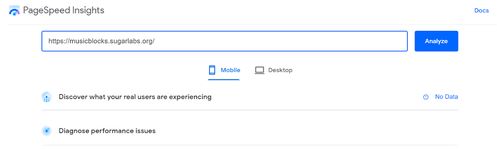
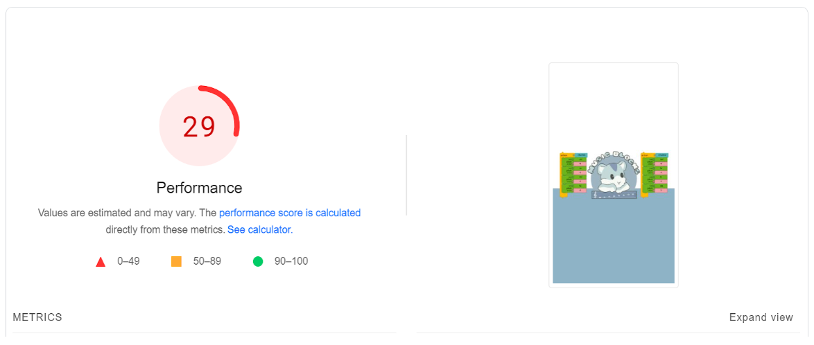
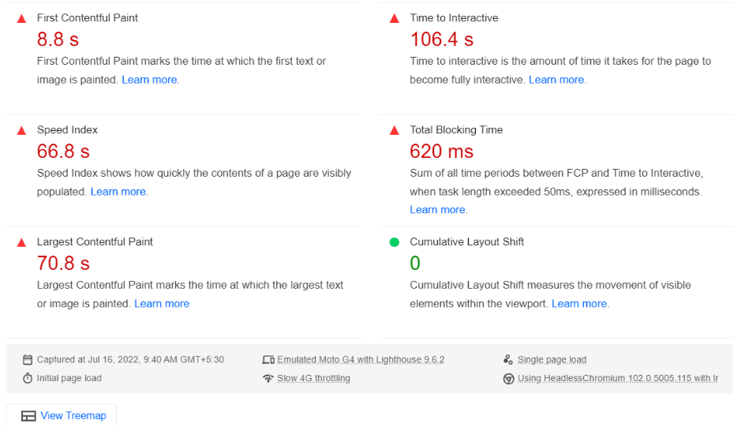
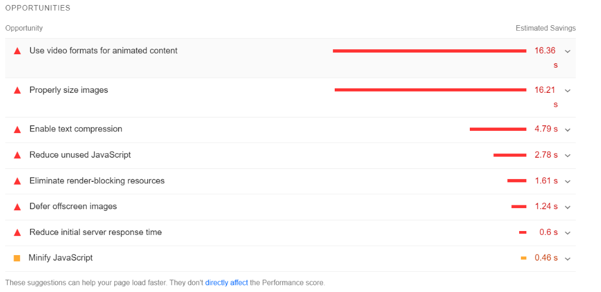
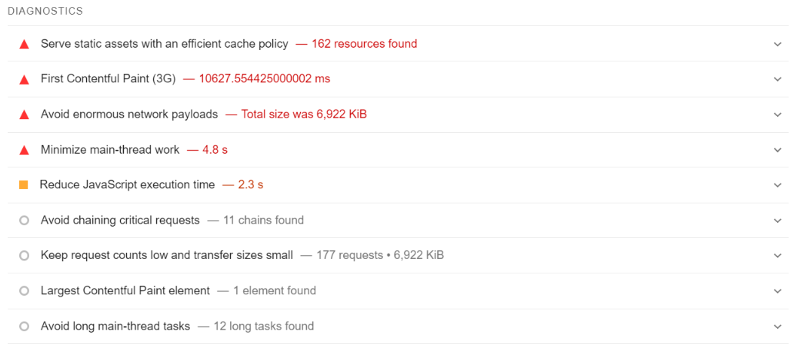

Overall Performance Score :- **29/100**

**Resolution :-**

<ol>
    <li><b> Deleted -- /loading-animation.gif size- 3.44mb (3612912 kb) -> Added -- /loading-animation.mp4 size - less than 260kb</b>

Estimated Savings - **2.66 seconds**

Animated GIFs have three key traits that a video needs to replicate:

<ul>
    <li>They play automatically.</li>
    <li>They loop continuously (usually, but it is possible to prevent looping).</li>
    <li>They're silent.</li>
</ul>
Using video tag and it's attributes recreated these behaviors.

Details on how to convert artwork[GIF] to video is elaborated [here](https://github.com/sugarlabs/musicblocks/blob/master/video.md).

This step solves many problems of loading issue:-
<ul>
    <li>Use video formats for animated content with proper sizing. (Savings - 2.66s )</li>
    <li>Largest contentful paint. (40s to less than 2s, savings - more than 30s)</li>
    <li>Makes the android version robust.</li>
</ul>
    </li>
    <li><b>Changing img to amp-img</b>

AMP may choose to delay or prioritize resource loading based on the viewport position, system resources, connection bandwidth, or other factors. The amp-img components allows the runtime to effectively manage image resources this way.

Potential savings :-
Memory = **276.5kb + 18.3kb**
Time = **0.2s**
    </li>
</ol>

`Eliminate render blocking resources was also a potential method to save more load time however these changes make the index.html file very unreadable and have a little or no affect on loading reliability of requirements and thus making a script inline is not a very efficient solution to the problem at hand , henceforth will be discontinued .`
[Learn More](https://github.com/sugarlabs/musicblocks/pull/3040).

After implementation:- 

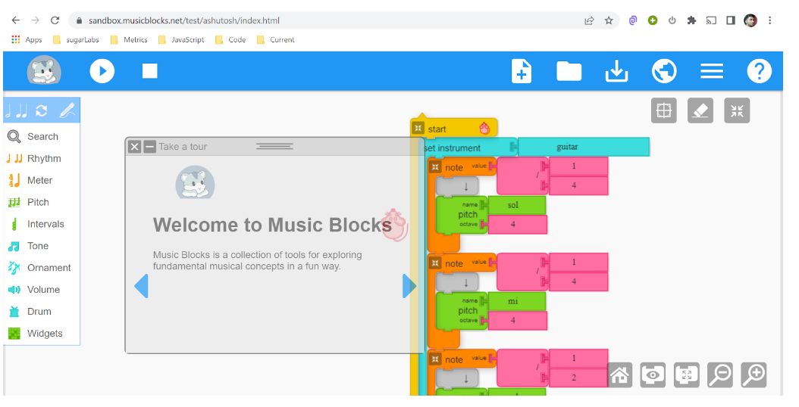
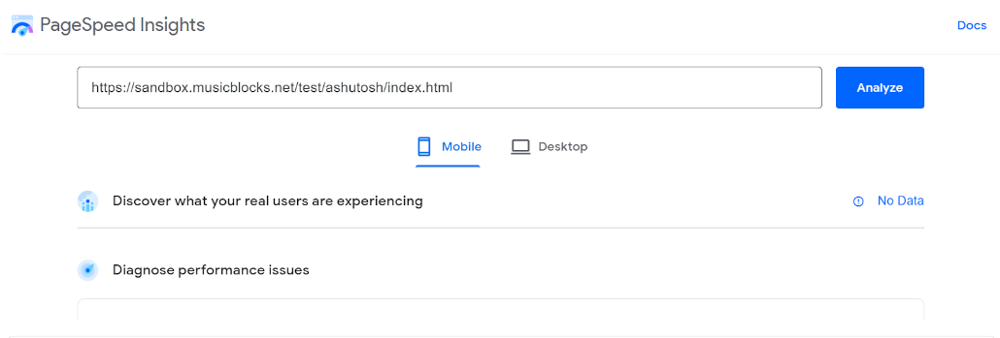
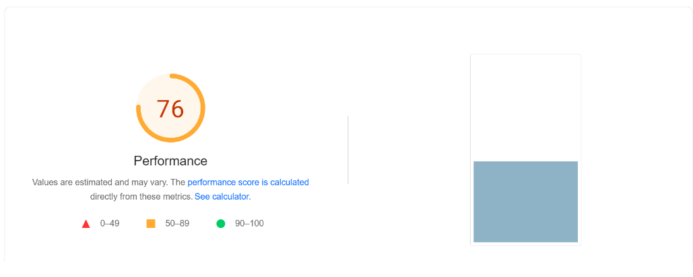
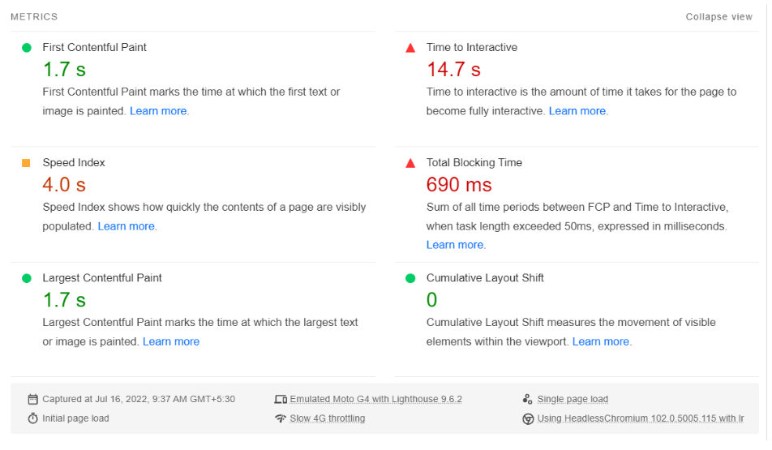
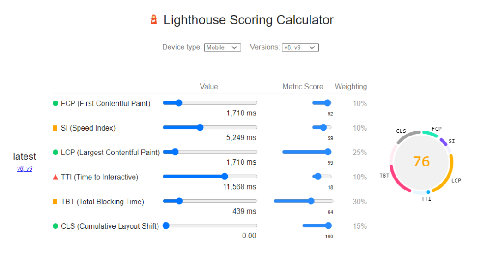

Overall Performance Score :- **76/100**

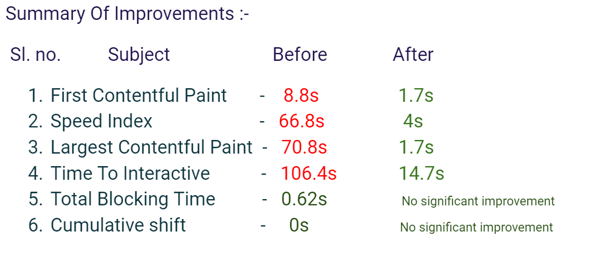

**Loading reliability** and speed is increased from **29/100** to **76/100** . Improvement of more than **162%** .

`This issue addresses the barebones and major sections by which loading reliability is very low`:

<table>
    <tr>
        <td> 🐛 Issue </td> 
        <td> #3035 #3039 #3042 #3045 #3046 #3047 #3048 </td>
        <td> <a href="https://github.com/sugarlabs/musicblocks/issues/3035" target="_top">Loading Of Requirements</a></td>
    </tr>
    <tr>
        <td> 🔀 PR </td> 
        <td> #3043 #3048 </td>
        <td> <a href="https://github.com/sugarlabs/musicblocks-v4/pull/71" target="_top">Loading Of Requirements PR</a></td>
    </tr>
    <tr>
        <td> 🎉 Commits </td> 
        <td> 6 </td>
        <td> <a href="https://github.com/sugarlabs/musicblocks/pull/3038/commits" target="_top"> all-commits</a></td>
    </tr>
</table>

`There were total of six commits consisting of defer offscreen images, using video formats and proper sizing of media files.`

## 📝 Cross Origin Errors

**Before:-**
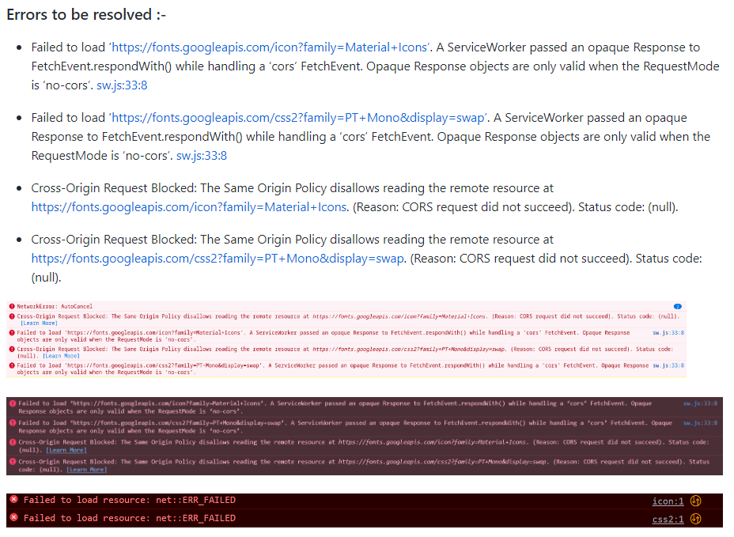

**Solution:-**

Cross origin is arising due to the fonts that are being accessed from google API , removing that section of code resolves this issue.

**After:-**
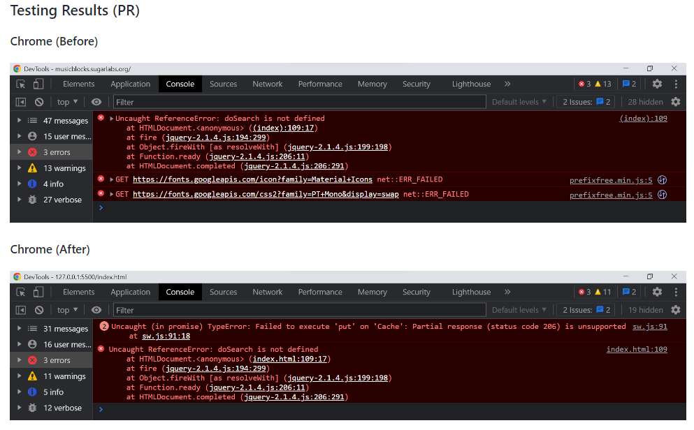

<table>
    <tr>
        <td> 🐛 Issue </td> 
        <td> #3049 </td>
        <td> <a href="https://github.com/sugarlabs/musicblocks/issues/3049" target="_top">Cross origin errors </a></td>
    </tr>
    <tr>
        <td> 🔀 PR </td> 
        <td> #3050 </td>
        <td> <a href="https://github.com/sugarlabs/musicblocks/pull/3050" target="_top">cross origin errors removed</a></td>
    </tr>
    <tr>
        <td> 🎉 Commits </td> 
        <td> 1 </td>
        <td> <a href="https://github.com/sugarlabs/musicblocks-v4/pull/3050/files" target="_top"> all-commits</a></td>
    </tr>
</table>

## 📝 Regression in music utils 

**For the blocks :-**

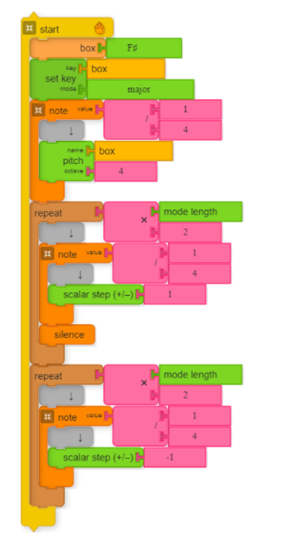

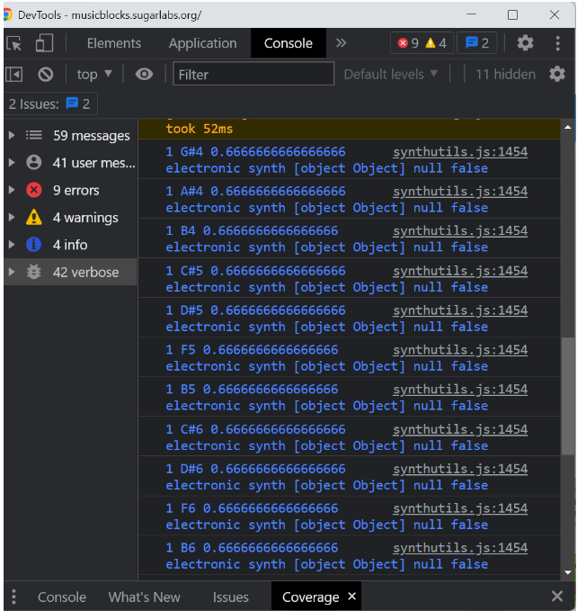

`F♯4, G♯4, A♯4, B4, C♯5, D♯5, E♯5 F♯5, G♯5, A♯5, B5, C♯6, D♯6, E♯6` is what one would expect to see
So the transition from D#5 to F5 is where things begin to break down.
The F# through A# are skipped for some reason.
Maybe it gets confused when it does the conversion from D# to F (which it really should not be doing in F# Major)

**Solution:-**

F# major is broken due to a nomenclature anomaly
F# major (full, full, half, full, full, full, half) is:
`F# -> G# -> A# -> B -> C# -> D# -> E# -> (+1)F#`
this is the internal representation used
`F#, G#, A#, B, C#, D#, E#, F#`
the thing is ... E# is same as F
so the code is trying to find F in the scale (list) but the list instead has E#
improve on the "find in list". Instead of string equality if you can find logical equality it should fix it.
Say something like
obj.findIndex(item => logicalEquals(item, thisPitch))
the new logicalEquals function should return true for E# and F, E and Fb, etc but false for say E# and F#
whenever there are two white keys in a row. E==Fb and E#==F; B==Cb and B#==C

**After implementation:-**

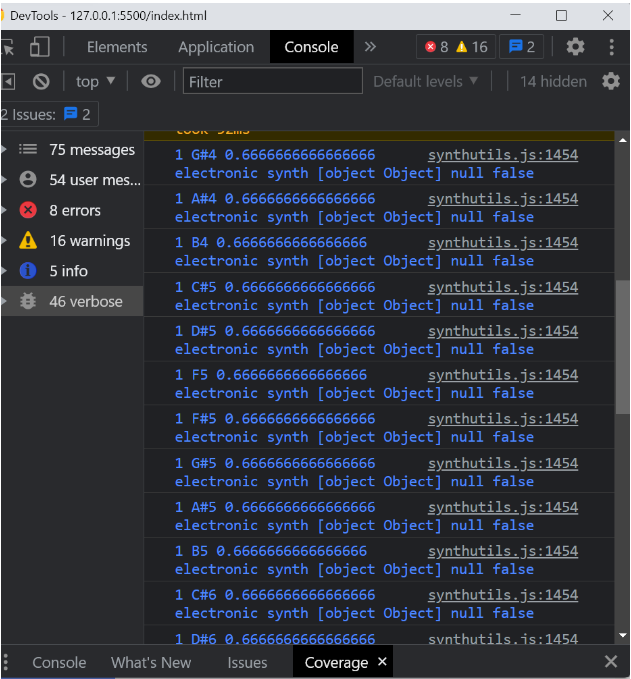

<table>
    <tr>
        <td> 🐛 Issue </td> 
        <td> #3055 </td>
        <td> <a href="https://github.com/sugarlabs/musicblocks/issues/3055" target="_top">Regression in musicutils code</a></td>
    </tr>
    <tr>
        <td> 🔀 PR </td> 
        <td> #3054 </td>
        <td> <a href="https://github.com/sugarlabs/musicblocks/pull/3054" target="_top">Regression Resolved</a></td>
    </tr>
    <tr>
        <td> 🎉 Commits </td> 
        <td> 3 </td>
        <td> <a href="https://github.com/sugarlabs/musicblocks/pull/3054/files" target="_top"> all-commits</a></td>
    </tr>
</table>

`There were total three commits consisting of actual code change and then formatting of code through prettier to follow the style of rest of the code. `

## 📝 Documentation Maintenance

This work was basically divided into two major portions, first to fix the way **image is linked to readme files** as the link to images(svg files) should appear in proper format showing the hierarchy of folders and files where it is located instead of camo image link that was appearing before and added missing image example like `no-clock.svg` .

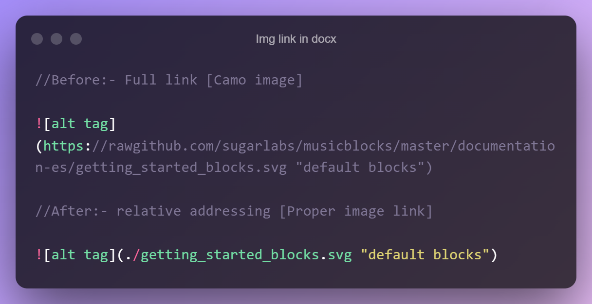

Second, was **set-key documenation**, in which the proper description was to be added for set-key block with an example and table of how key, modes and pattern changes with the value of set key block.

[Set Key](https://github.com/Traitor000/musicblocks/tree/set-key/guide#325-set-key)

<table>
    <tr>
        <td> 🐛 Issue </td> 
        <td> #3061 </td>
        <td> <a href="https://github.com/sugarlabs/musicblocks-v4/issues/3061" target="_top">Image link in docx </a></td>
    </tr>
    <tr>
        <td> 🔀 PR </td> 
        <td> #3069 </td>
        <td> <a href="https://github.com/sugarlabs/musicblocks-v4/pull/3069" target="_top">fixed img link and added no-clock.svg</a></td>
    </tr>
    <tr>
        <td> 🔀 PR </td> 
        <td> #3070 </td>
        <td> <a href="https://github.com/sugarlabs/musicblocks-v4/pull/3070" target="_top">Set-Key</a></td>
    </tr>
    <tr>
        <td> 🎉 Commits </td> 
        <td> 15 </td>
        <td> <a href="https://github.com/sugarlabs/musicblocks-v4/pull/3070/commits" target="_top"> set key and img link commits</a></td>
    </tr>
</table>

`There were a total of *fifteen* commits which include adding image, table and description of set key and image link fix with no-clock.svg.`

## 🚀 Other bugs and fixes

Other than the main aim of the project, along the way I also made fixes that will ease the work for future contributors , and also become very handy to the users of v3.

<ul>
    <li>Deleted galton-music.html (unnecessary file)</li>
    <li>Removed Warning when longer than 2 notes are played.</li>
</ul>

<table>
    <tr>
        <td> 🐛 Issue </td> 
        <td> #3065 </td>
        <td> <a href="https://github.com/sugarlabs/musicblocks-v4/issues/3065" target="_top">Warning for long notes</a></td>
    </tr>
    <tr>
        <td> 🔀 PR </td> 
        <td> #3067 </td>
        <td> <a href="https://github.com/sugarlabs/musicblocks-v4/pull/3067" target="_top">Removed warning</a></td>
    </tr>
     <tr>
        <td> 🔀 PR </td> 
        <td> #3041 </td>
        <td> <a href="https://github.com/sugarlabs/musicblocks-v4/pull/3041" target="_top">Deleted galton-music.html</a></td>
    </tr>
</table>

### ✨ Enhancements

There are many enhancements that can be done particularly to improve characterization and modularity of code which will further improve the loading reliability, also there are many small bugs which can be resolved which are listed in the issues section of the repository.

Some issues that are particularly fun to solve are :-

[1. Remove Arrow](https://github.com/sugarlabs/musicblocks/issues/3066)

[2. Wav files](https://github.com/sugarlabs/musicblocks/issues/3064)

[3. Drag in touchscreen](https://github.com/sugarlabs/musicblocks/issues/3011)

### 👨 Acknowledgements

On a final note, I am extremely grateful to my mentors, [Walter Bender](https://web.media.mit.edu/~walter/), [Devin Ulibarri](https://github.com/pikurasa) and [Anindya Kundu](https://github.com/meganindya).I am also very thankful for their regular feedbacks and constant support throughout which helped me in improving the quality of my code and helping me improve my soft skills which reulted in successful completetion of the project within the time period.

Thanks to [Google](https://www.google.com/), [GSoc](https://summerofcode.withgoogle.com/) ,[Sugarlabs](https://www.sugarlabs.org/) and [MusicBlocks](https://musicblocks.sugarlabs.org/) for this great opportunity.

Thanks

Ashutosh Gautam

